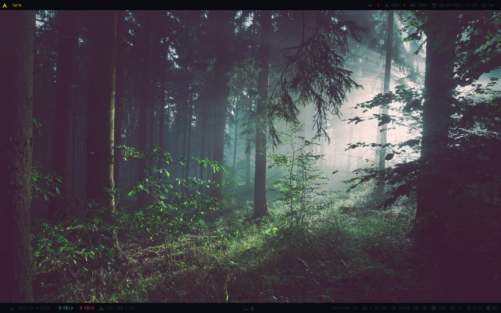

# NIX

My [Arch Linux](https://archlinux.org/) environment configuration

## TODO

- [ ] Rename repos to nix
- [ ] Split this configuration into branch for each environment
- [ ] Check for security issues, mutt and others. Encrypt credentials locally
- [ ] Document some configurations, bash, neovim ... or refer to notes?
- [ ] Clean fonts, add wallpapers, icons and sounds and doc
- [ ] Udev
  - [ ] Rules to restrict auto mounting of only my USB sticks (serials)
  - [ ] Auto switch alsa when plug/unplug headphone

## Requirements

An Arch Linux environment running.

## Installation

This configuration is based on branching the master for each of my environment. I do so I can keep my hardware, monitors setup and window manager configuration separate but all based on the same configurations.

### For an existing environment

Switch to the branch containing the corresponding configuration and run the `install.sh` file.

### For a new environment

Create a new branch

### Configuration

You can choose what configuration packages to install by editing `config-packages.txt`
> See `pacman-packages.txt` to view all the required required packages.

#### Monitor

Create a local configuration by editing the `/config/xrandr/.xrandr` file.

### Windows manager

- i3
 Multimedia Keys
 Configure workspaces and monitors associations in `/.config/i3/config`
 > FIXME: Workspaces configuration include not working!

- Polybar
 
 Configure system paths and hardware in `/.config/polybar/hardware.ini`

Finally run the `install.sh` script.

## Structure

The configuration is split like this:

- `bin` contains all the executable and will be symlinked into `$XDG_BIN_HOME`
 see: ...
- `config` contains all the configuration files. Will default to
 `XDG_CONFIG_HOME` or `HOME`.
- `data` contains resources like: dictionaries, icons, sounds used by programs.
 programs.

## Softwares

### Base environment

- Bash (Shell)
- Git (Version control)
- Irssi (IRC client)
- Mutt (Email client)
- Neovim (Text editor)
- Newsboat (News feed client)
- Pacman (ArchLinux package manager)
- Ranger (File)
- Surf (Browser)
- Sxiv (Image viewer)
- Tmux (Terminal multiplexing)
- Urxvt (Terminal emulator)
- Vim (Text editor)
- Xterm (Terminal emulator)
- Zathura (PDF viewer)
- Zsh (Shell)

## Graphic environment

- Dmenu-patched (Menu)
- Dunst (Notification)
- GTK (GUIs)
- Polybar (Status bar)
- i3 (Window manager)

## Utils

- Sc (Spreadsheet calculator)
- Htop (System monitoring)
- Alsa (Advanced Linux Sound Architecture)
- Bat (Cat like)
- Cloc (Count line of code)
- Colorpicker (A color picker! :))
- Cups (Printer) TODO: Need config
- FFmpeg (Video tools)
- Freerdp (Remote desktop)
- Fzf
- Jq
- Mpv (Video player)
- Nitrogen (Desktop background)
- Nmcli (Network manager)
- Pandoc (Markup converter)
- Pcmanfm (File manager)
- Screenkey (On-Screen Keyboard)
- Scrot (Screenshot)
- Ueberzug (Image preview, I use it for Ranger)
- Xdotool (X11 automation; keyboard, mouse, windows)
- Xev (X events)
- Xinit
- Xmodmap (Keymaps and pointer button mappings in Xorg)
- Xprop (Window and font properties in an X server)
- Xrdb (Xresource database manager)
- Xscreensaver
- Zenity (GTK UIS)

## Additional software

- Aseprite (Pixel graphics editor)
- Galculator (Calculator)
- Gimp (Image manipulation program)
- Inkscape (Vector graphics editor)
- Kdenlive (Video editing)
- Postman (API testing)
- Remmina (Remote desktop)
- VScode (Source code editor)

## Programming

See my Neovim configuration.

- Android SDK
- Clang (C, C++)
- Composer
- Dart
- Docker
- Flutter
- GO
- NPM
- Perl
- Ruby
- Yarn
- SQL sqlite3, sqlitebrowser, sqldiff

## Data

Data and media used by programs and configurations. They will be symlinked in `XDG_DATA_HOME`.

- Dict

 The spelling dictionaries I use in Neovim or Vim.

- Fonts

 Fonts used in Xresources, GTK, i3 and Polybar.

 > Updates Xresources references

- Icons

 The icons used for the notification system.

- Mime

 The mime/type associations I use.

- Sounds

 Sounds used for the notification system and scripts.

- Wallpapers

 A little collection of wallpapers I like.

## References

- <https://www.freedesktop.org/wiki/Specifications/>
- <https://wiki.archlinux.org/title/XDG_Base_Directory>
