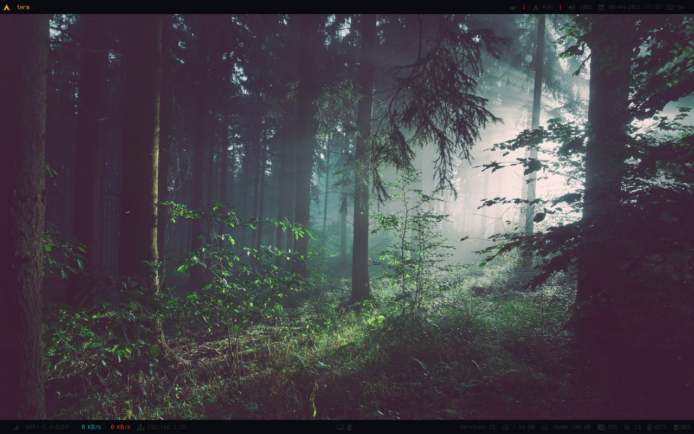

# Dotfiles

The dotfiles are split into 2 categories, `common` and `exclusive`. The `common` are shared accros multiple installation and the `exclusive` are for specific configuration, computers.

TODO: I need to split this configuration into git branches maybe ?!

## TODO

- Clean fonts, add wallpapers, icons and sounds.
- Check for security issues, mutt and others need crendentials. 

## Base  

These are the sofwares I use and their configuration file(s) if there are.

- Alacritty (Terminal emulator)
- Alsa (Advanced Linux Sound Architecture)
- Aseprite (Pixel graphics editor) 
- Bash (Shell)
- Clang (C, C++)
- Cloc (Count line of code)
- Colorpicker 
- Cups (Printer)
- Curl
- Dmenu
- Dunst (Notification)
- Freerdp
- FFmpeg
- Galculator
- Gimp (Image manipulation program)
- GIT
- GTK
- Htop
- Iftop
- Irssi (IRC client)
- Inkscape (Vector graphics editor)
- Jq
- Kdenlive (Video editing)
- Mpv
- Mutt
- Newsboat
- Nitrogen
- Pacman
- Pandoc
- Pcmanfm
- Picom
- Postman
- Ranger
- Remmina
- Sc (Spreadsheet calculator)
- Screenkey
- Scrot (Screenshot)
- Surf (Browser)
- Sxiv (Image viewer)
- Tmux (Terminal multiplexing)
- Urxvt (Terminal emulator)
- Ueberzug (Image preview, I use it for Ranger)
- Vim (Text editor)
- VScode (Source code editor)
- Weechat (IRC client)
- Xdotool (X11 automation; keyboard, mouse, windows)
- Xev (X events)
- Xinit
- Xmodmap (Keymaps and pointer button mappings in Xorg)
- Xprop (Window and font properties in an X server)
- Xrdb (Xresource database manager)
- Xscreensaver 
- Zathura (PDF viewer)
- Zsh (I don't really use this) 

## Windows Manager ans Status bars

- i3
- Polybar

## Programming

- Android SDK
- Composer
- Dart
- Docker
- Flutter
- Ruby
- GO
- Yarn
- NPM
- Perl

## Resource

Theses resources are needed by some of my configurations files.

### Fonts

### Icons

The icons are mainly and only at the moment used for the notification system [Dunst](https://github.com/dunst-project/dunst)

### Sounds

### Wallpapers
